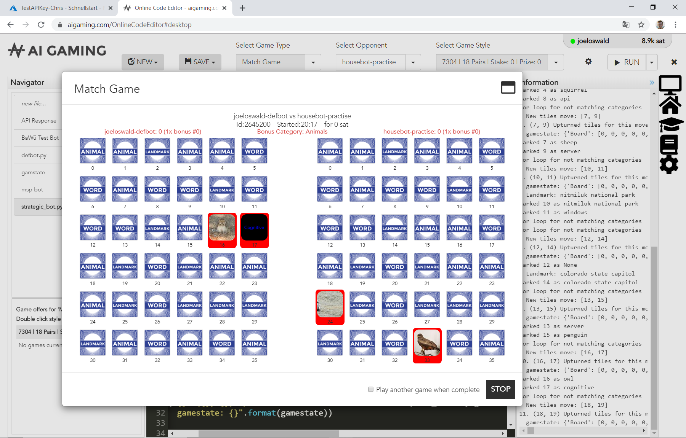
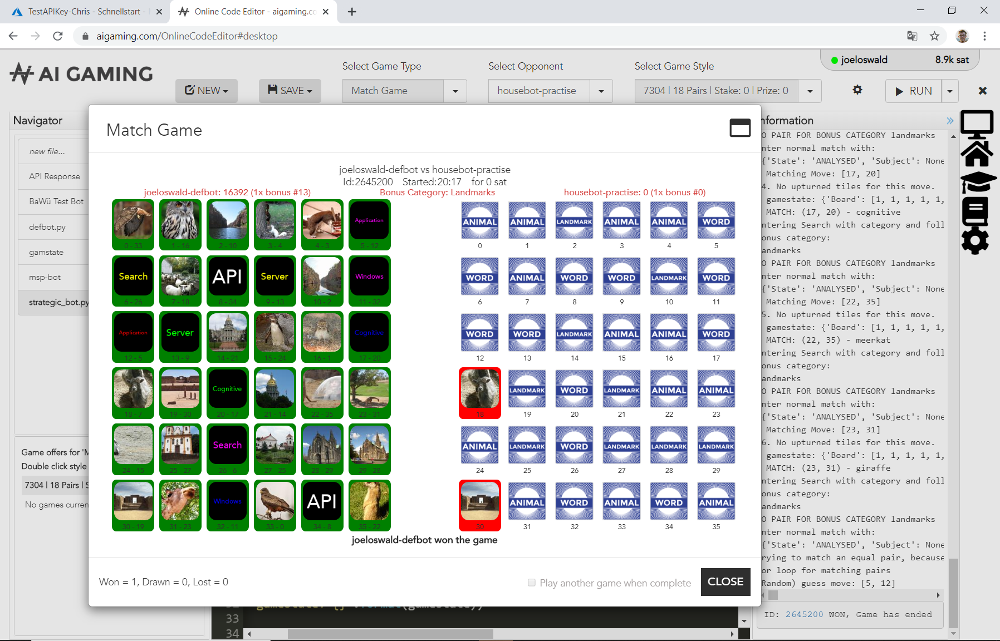

# AIGaming
Working on a good bot to play the match game on aigaming.com

Not perfect yet, but should reach several thousend Points each game. 
Tries to handle the not uncommon case if a word is not recognised by the Azure API.

### Step 1
The bot is first analyzing all tiles, so not getting any points for the first 18 rounds:

### Step 2
But then, as long as possible all matches are done, according to the given bonus category.
But since the bonus categories are completly random it is rather likely, that the last (few) categories to be matched are unequal the bonus category. 

